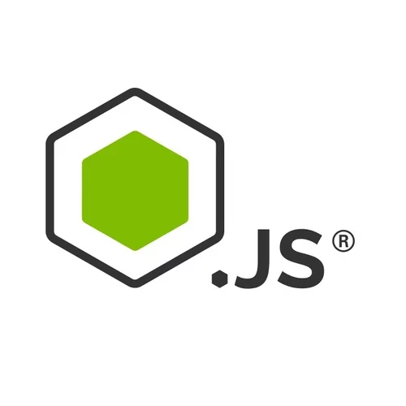

# article-task
<div id="top"></div>

[![Forks][forks-shield]][forks-url]
[![Stargazers][stars-shield]][stars-url]
[![Issues][issues-shield]][issues-url]
[![MIT License][license-shield]][license-url]


<!-- PROJECT LOGO -->
<br />
<div align="center">

  <a href="https://github.com/GrigoriGrigoryan/NodeJS-Test-Assignment">
    
  </a>

<h3 align="center">Article Task</h3>

  <p align="center">
    Read README to jumpstart project!
    <br />
    <a href="https://github.com/GrigoriGrigoryan/NodeJS-Test-Assignment"><strong>Explore the docs »</strong></a>
    <br />
    <br />
    <a href="https://github.com/GrigoriGrigoryan/NodeJS-Test-Assignment">View Demo</a>
    ·
    <a href="https://github.com/GrigoriGrigoryan/NodeJS-Test-Assignment/issues">Report Bug</a>
    ·
    <a href="https://github.com/GrigoriGrigoryan/NodeJS-Test-Assignment/issues">Request Feature</a>
  </p>
</div>


<!-- TABLE OF CONTENTS -->
<details>
  <summary>Table of Contents</summary>
  <ol>
    <li>
      <a href="#about-the-project">About The Project</a>
      <ul>
        <li><a href="#built-with">Built With</a></li>
      </ul>
    </li>
    <li>
      <a href="#getting-started">Getting Started</a>
      <ul>
        <li><a href="#prerequisites">Prerequisites</a></li>
        <li><a href="#installation">Installation</a></li>
      </ul>
    </li>
    <li><a href="#usage">Usage</a></li>
    <li><a href="#roadmap">Roadmap</a></li>
    <li><a href="#contributing">Contributing</a></li>
    <li><a href="#license">License</a></li>
    <li><a href="#contact">Contact</a></li>
    <li><a href="#acknowledgments">Acknowledgments</a></li>
  </ol>
</details>


<!-- ABOUT THE PROJECT -->
## About The Project

Node.Js Test Assignment 


<p align="right">(<a href="#top">back to top</a>)</p>


### Built With

This section should list any major frameworks/libraries used to bootstrap my project.

* [Node.js](https://nodejs.org/)
* [Typescript](https://www.typescriptlang.org/)

<p align="right">(<a href="#top">back to top</a>)</p>


<!-- GETTING STARTED -->
## Getting Started

This is an example of how you may set up your project locally.
To get a local copy up and running follow these simple example steps.


### Installation

1. Clone the repo
   ```sh
   git clone https://github.com/your_username_/Project-Name.git
   ```
2. Install NPM packages
   ```sh
   npm install
   ```

<p align="right">(<a href="#top">back to top</a>)</p>


<p align="right">(<a href="#top">back to top</a>)</p>


<!-- ROADMAP -->
## Roadmap

- [x] HTTP Request Handling
- [x] Counter Function
- [x] Services Interaction
- [x] Database Structure


<p align="right">(<a href="#top">back to top</a>)</p>


<!-- CONTRIBUTING -->
## Contributing

Contributions are what make the open source community such an amazing place to learn, inspire, and create. Any contributions you make are **greatly appreciated**.

If you have a suggestion that would make this better, please fork the repo and create a pull request. You can also simply open an issue with the tag "enhancement".


1. Fork the Project
2. Create your Feature Branch (`git checkout -b feature/AmazingFeature`)
3. Commit your Changes (`git commit -m 'Add some AmazingFeature'`)
4. Push to the Branch (`git push origin feature/AmazingFeature`)
5. Open a Pull Request

<p align="right">(<a href="#top">back to top</a>)</p>


<!-- LICENSE -->
## License

Distributed under the MIT License. See `LICENSE.txt` for more information.

<p align="right">(<a href="#top">back to top</a>)</p>


<!-- CONTACT -->
## Contact

Grigori - grigorigrigoryan8@gmail.com

Project Link: [https://github.com/GrigoriGrigoryan/NodeJS-Test-Assignment](https://github.com/GrigoriGrigoryan/NodeJS-Test-Assignment)

<p align="right">(<a href="#top">back to top</a>)</p>


<p align="right">(<a href="#top">back to top</a>)</p>


[forks-shield]: https://img.shields.io/github/forks/GrigoriGrigoryan/backend-team.svg?style=for-the-badge
[forks-url]: https://github.com/GrigoriGrigoryan/backend-team/network/members
[stars-shield]: https://img.shields.io/github/stars/GrigoriGrigoryan/backend-team.svg?style=for-the-badge
[stars-url]: https://github.com/GrigoriGrigoryan/backend-team/stargazers
[issues-shield]: https://img.shields.io/github/issues/GrigoriGrigoryan/backend-team.svg?style=for-the-badge
[issues-url]: https://github.com/GrigoriGrigoryan/backend-team/issues
[license-shield]: https://img.shields.io/github/license/GrigoriGrigoryan/backend-team.svg?style=for-the-badge
[license-url]: https://github.com/othneildrew/GrigoriGrigoryan/backend-team/blob/master/LICENSE.txt

